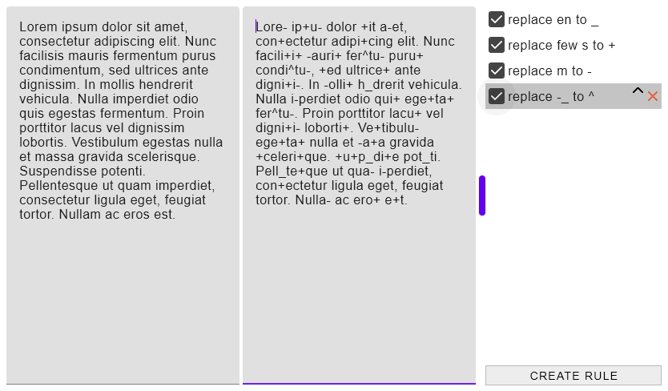
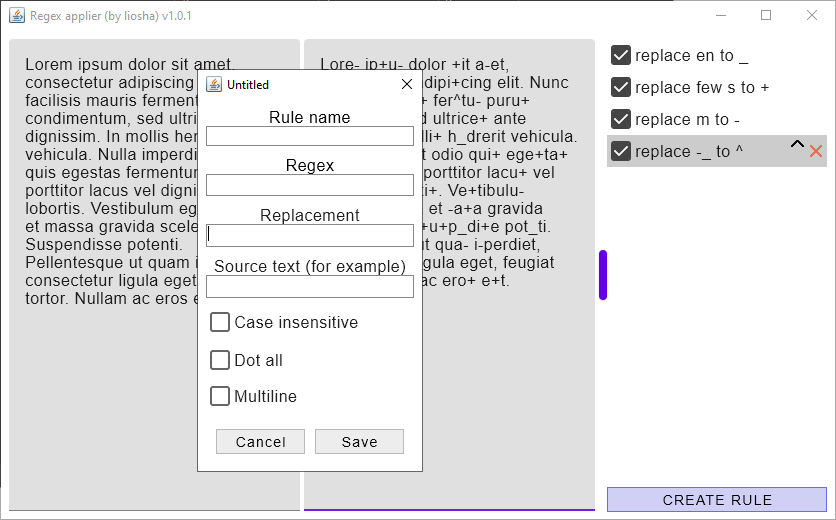
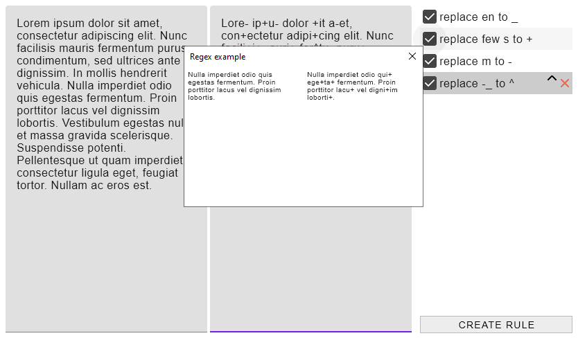

# Regex Applier
Desktop application that applies a list of regexes to a text

## Main window



## Dialog for creating regex



## Tooltip that shows example of regex functionality



### Functionality

* Just paste source text into the left text area and you will have result text in the right area
* You can disable/enable any rule using checkboxes
* You can easily change order of regexes
* Example of regex result is shown moving mouse over checkbox

## Development details

### Compiling Windows installer

```shell
gradlew.bat clean packageMsi
```

### Running the project

```shell
gradlew.bat clean run
```